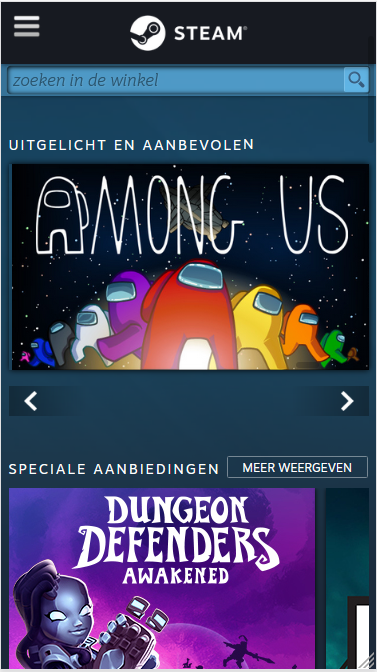

# Procesverslag
**Auteur:** Marlow Magtibay 500829372

Markdown cheat cheet: [Hulp bij het schrijven van Markdown](https://github.com/adam-p/markdown-here/wiki/Markdown-Cheatsheet). Nb. de standaardstructuur en de spartaanse opmaak zijn helemaal prima. Het gaat om de inhoud van je procesverslag. Besteedt de tijd voor pracht en praal aan je website.

## Bronnenlijst
1. -bron 1-
2. -bron 2-
3. -...-

## Eindgesprek (week 7/8)

-dit ging goed & dit was lastig-

**Screenshot(s):**

-screenshot(s) van je eindresultaat-

## Voortgang 3 (week 6)

-same as voortgang 1-

## Voortgang 2 (week 5)

-same as voortgang 1-

## Voortgang 1 (week 3)

### Stand van zaken

-dit ging goed & dit was lastig-

**Screenshot(s):**

-screenshot(s) van hoe ver je bent-

### Agenda voor meeting

-samen met je groepje opstellen-
Donderdag 17 september 16:30 uur
Aanwezig: Britt, Aaron, Ties, Robin, Enes, Marlow

### Verslag van meeting
Team 1, er was hier en daar wat moeite met het plaatsen van elementen,
flexbox en margin waren niet de oplossing voor de problemen.
Een pagina van Genius met heel veel aparte stukjes bij elkaar, voor het
grootste deel sections gebruikt... Is dat erg? Het aantal sections maakt
niet uit zolang je weet waarom je de sections nodig hebt en uit kan leggen.

-na afloop snel uitkomsten vastleggen-

## Codepen
**Les 1: Typografie**
Oefening 1: https://codepen.io/marlowcmd/details/YzqEPMP
Oefening 2: https://codepen.io/marlowcmd/details/vYGWNKd

**Les 2: Positioneren**
Oefening 1: https://codepen.io/marlowcmd/pen/dyMdOro

**Les 3: Flexbox**
Oefening 1: https://codepen.io/marlowcmd/pen/xxVWzXJ
Oefening 2: https://codepen.io/marlowcmd/details/YzqavgK

**Les 4: Javascript**
Oefening 1: https://codepen.io/marlowcmd/pen/oNxyEge
Oefening 2.1: https://codepen.io/marlowcmd/pen/zYqLxEg
Oefening 2.2: https://codepen.io/marlowcmd/pen/MWyBYOL

## Intake (week 1)

**Je startniveau:** De rode piste. Voor de eindopdracht van Internetstandaarden in de propedeuse heb ik een cijfer gehaald waar ik zeker trots op kan zijn en ik heb ook wel een interesse voor dit soort vakken. Ik heb er echter niet meer zoveel mee gedaan, omdat ik echt een project idee nodig heb waar ik vaker aan wil werken.

**Je focus:** Helemaal responsive

**Je opdracht:** https://store.steampowered.com/

**Screenshot(s):**

**Breakdown-schets(en):**

