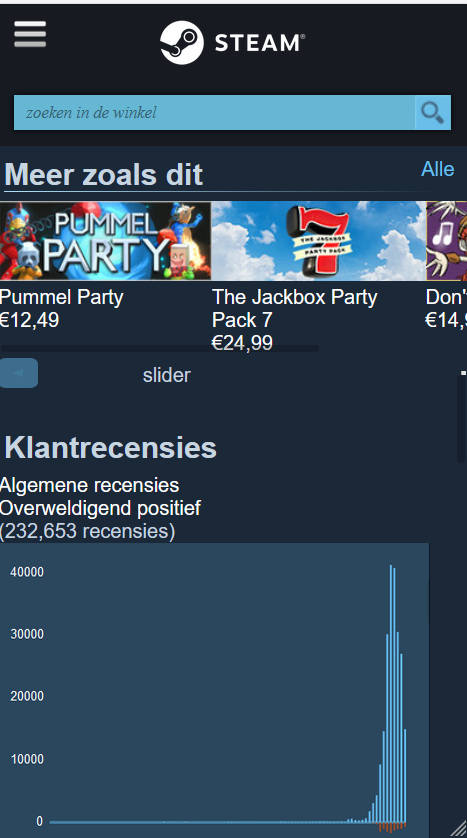

# Procesverslag
**Auteur:** Marlow Magtibay 500829372

Markdown cheat cheet: [Hulp bij het schrijven van Markdown](https://github.com/adam-p/markdown-here/wiki/Markdown-Cheatsheet). Nb. de standaardstructuur en de spartaanse opmaak zijn helemaal prima. Het gaat om de inhoud van je procesverslag. Besteedt de tijd voor pracht en praal aan je website.

## Bronnenlijst
1. https://www.w3schools.com
2. https://css-tricks.com/
3. https://store.steampowered.com/
4. https://stackoverflow.com/questions/17868503/on-css-if-text-line-is-break-show-dots

## Herkansing (3 november)

Goed: de states moesten alleen specifieker aangegeven worden. Daardoor
werkte het uiteindelijk soepel.
Slecht: Sommige elementen veranderen niet alleen van grootte op andere
schermformaten, maar verplaatsen af en toe ook. Dat was even vervelend.

**Screenshots(s):**

## Eindgesprek (week 7/8)

Goed: De javascript was wel te doen
Slecht: Veel elementen waren vervelend om te positioneren

**Screenshot(s):**

## Voortgang 3 (week 6)

### Stand van zaken

Goed: Het begint allemaal samen te komen. Veel van de stijling begint 
op elkaar te lijken, waardoor ik met classes veel kan doen.
Slecht: Ik was heel lang bezig met het stijlen van de header. Het was
moeilijk omdat de images beide elke keer aangeroepen werden. Het is
uiteindelijk met een grote omweg gelukt, classes.

## Voortgang 2 (week 5)

### Stand van zaken

Goed: De images voor bijvoorbeeld achtergronden die ik eerst niet kon
vinden, heb ik nu wel gevonden. Dus het begint er op sommige plekken wel
wat meer op te lijken daardoor.
Slecht: Ik heb veel moeten doen met het plaatsen van elementen, een blok
met een percentage bijvoorbeeld naast een afgeprijsde prijs met daaronder
de nieuwe prijs. Ik merkte dat ik hierdoor heel veel divs heb gekregen.

**Screenshot(s):**

## Voortgang 1 (week 3)

### Stand van zaken

Goed: Meeste html elementen van de site waren wel makkelijk te herkennen
en verzinnen wanneer het een div was.
Slecht: Een aantal nieuwe manieren vinden om bepaalde elementen te laten
zien, die ik nog niet gebruikt heb tot nu toe.

**Screenshot(s):**

### Agenda voor meeting

Donderdag 17 september 16:30 uur
Aanwezig: Britt, Aaron, Ties, Robin, Enes, Marlow

### Verslag van meeting
Team 1, er was hier en daar wat moeite met het plaatsen van elementen,
flexbox en margin waren niet de oplossing voor de problemen.
Een pagina van Genius met heel veel aparte stukjes bij elkaar, voor het
grootste deel sections gebruikt... Is dat erg? Het aantal sections maakt
niet uit zolang je weet waarom je de sections nodig hebt en uit kan leggen.

## Codepen

***Week 6***
**Les 8: Toegankelijkheid**

Oefening 2.1: https://codepen.io/marlowcmd/pen/PozYPqX
Oefening 2.2: https://codepen.io/marlowcmd/pen/eYzOZZa

***Week 5***
**Les 7: Animaties**

Oefening 1: https://codepen.io/marlowcmd/pen/LYNvEmj
Oefening 2: https://codepen.io/marlowcmd/pen/RwaOxWg

***Week 4***
**Les 5: Grids**

Oefening 1: https://codepen.io/marlowcmd/pen/JjXevve
Oefening 2: https://codepen.io/marlowcmd/pen/qBZQKGN 

**Les 6: Media queries**

Oefening 1: https://codepen.io/marlowcmd/pen/OJNdxyV
Oefening 2: https://codepen.io/marlowcmd/pen/BaKMrLm

***Week 3***
**Les 4: Javascript**

Oefening 1: https://codepen.io/marlowcmd/pen/oNxyEge
Oefening 2.1: https://codepen.io/marlowcmd/pen/zYqLxEg
Oefening 2.2: https://codepen.io/marlowcmd/pen/MWyBYOL

***Week 2***
**Les 2: Positioneren**

Oefening 1: https://codepen.io/marlowcmd/pen/dyMdOro

**Les 3: Flexbox**

Oefening 1: https://codepen.io/marlowcmd/pen/xxVWzXJ
Oefening 2: https://codepen.io/marlowcmd/details/YzqavgK

***Week 1***
**Les 1: Typografie**

Oefening 1: https://codepen.io/marlowcmd/details/YzqEPMP
Oefening 2: https://codepen.io/marlowcmd/details/vYGWNKd

## Intake (week 1)

**Je startniveau:** De rode piste. Voor de eindopdracht van Internetstandaarden in de propedeuse heb ik een cijfer gehaald waar ik zeker trots op kan zijn en ik heb ook wel een interesse voor dit soort vakken. Ik heb er echter niet meer zoveel mee gedaan, omdat ik echt een project idee nodig heb waar ik vaker aan wil werken.

**Je focus:** Helemaal responsive

**Je opdracht:** https://store.steampowered.com/

**Screenshot(s):**

**Breakdown-schets(en):**

